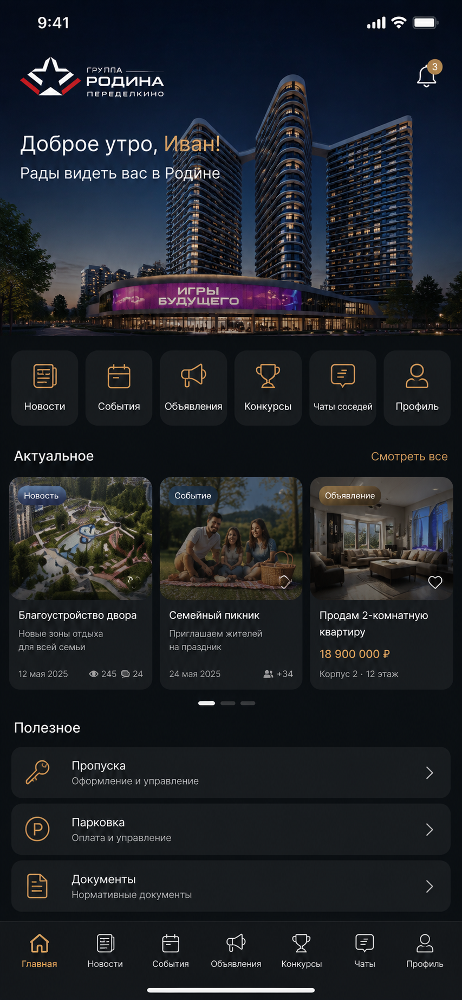

# 🏙️ Rodina Peredelkino Community

> Больше, чем приложение жилого комплекса.
>
> Цифровая экосистема, объединяющая весь жилой комплекс в одном приложении.

    

---

## 📖 Содержание

- О проекте
- Документация
- Миссия
- Видение
- Основные возможности
- Сообщество
- Конфиденциальность
- Open Source
- Долгосрочная цель
- Отказ от ответственности

---

# О проекте

**Rodina Peredelkino Community** — независимый open-source проект, вдохновленный жилым комплексом **«Родина Переделкино»**.

Идея проекта появилась из простого вопроса:

**Почему жителю современного жилого комплекса приходится пользоваться десятком разных приложений?**

Сегодня даже жители премиальных комплексов используют разные сервисы для повседневных задач:

- Telegram-чаты
- сайты управляющей компании
- приложения для умного дома
- телефоны консьержа
- сервисы оформления пропусков
- платежные системы
- объявления в подъезде
- группы в социальных сетях

Все это существует отдельно друг от друга.

Наша цель — объединить всю жизнь жилого комплекса в одном современном мобильном приложении.

**Настоящий «Город в приложении».**

---

# 📚 Документация

Документация проекта находится в папке `/docs`.

- 📖 Architecture
- 🗺️ Roadmap
- 🎨 UI Guidelines
- 🤝 Contributing

---

# Миссия

Мы считаем, что современные жилые комплексы заслуживают современную цифровую инфраструктуру.

Житель не должен задумываться:

> Где заказать гостевой пропуск?

> Как написать управляющей компании?

> Где связаться с консьержем?

> В каком чате обсуждают новости дома?

Все должно быть доступно в одном месте.

Одно приложение.

Один аккаунт.

Одно сообщество.

---

# Видение

Представьте, что открывая приложение, вы получаете доступ ко всему, что связано с вашим домом.

Не только к оплате услуг.

Не только к чатам.

Не только к умному дому.

А ко всей жизни жилого комплекса.

---

# Планируемые возможности

## 🏠 Для жителей

- профиль жителя
- управление квартирой
- гостевые пропуска
- пропуска для автомобилей
- цифровые ключи
- заявки в управляющую компанию
- оплата услуг
- уведомления о посылках
- вызов консьержа
- документы собственника

---

## 🏢 Управляющая компания

Всё взаимодействие с управляющей компанией должно происходить внутри приложения.

Планируется:

- онлайн-чат
- обращения
- заявки
- новости дома
- объявления
- голосования
- опросы
- уведомления
- документы
- обратная связь

---

## 🔐 Умный дом

Современный жилой комплекс должен использовать современные технологии.

Планируется поддержка:

- домофона
- цифровых ключей
- управления шлагбаумом
- вызова лифта
- камер видеонаблюдения
- парковки
- устройств IoT
- функций умной квартиры

---

## 💬 Общение

Вместо десятков Telegram-чатов жители получают единую систему общения.

В приложении смогут существовать:

- личные сообщения
- общий чат дома
- чат подъезда
- чат этажа
- чат управляющей компании
- чат консьержа

---

# 👥 Сообщество

Это одна из главных идей проекта.

Приложение должно помогать соседям становиться настоящим сообществом.

Жители смогут:

- знакомиться по интересам;
- объединяться в сообщества;
- организовывать мероприятия;
- создавать инициативные группы;
- помогать друг другу;
- продавать и обменивать вещи;
- публиковать объявления;
- проводить голосования;
- делиться рекомендациями.

Дом — это не только квартиры.

Дом — это люди.

---

# 🎁 Активности

Мы хотим, чтобы приложение объединяло жителей не только через сервисы.

Планируются:

- конкурсы;
- розыгрыши;
- сезонные мероприятия;
- достижения жителей;
- система лояльности;
- челленджи;
- рейтинги активности.

---

# 📅 События

Жители всегда смогут узнать, что происходит внутри жилого комплекса.

Например:

- детские праздники;
- спортивные мероприятия;
- кинопоказы;
- встречи жителей;
- мастер-классы;
- ярмарки;
- праздничные события.

---

# 🛍️ Маркетплейс

Закрытая площадка исключительно для жителей.

Можно будет:

- покупать;
- продавать;
- обменивать;
- отдавать бесплатно.

Все внутри сообщества дома.

---

# 🔒 Конфиденциальность

Безопасность жителей — один из главных приоритетов проекта.

В будущем приложение рассчитано на работу с подтвержденными жителями жилого комплекса.

Мы стремимся создать безопасную цифровую среду для общения и взаимодействия соседей.

---

# ❤️ Open Source

Проект развивается как Open Source, потому что подобную платформу невозможно создать в одиночку.

Мы будем рады участию:

- iOS-разработчиков;
- Backend-разработчиков;
- UI/UX-дизайнеров;
- специалистов по безопасности;
- инженеров Smart Home;
- DevOps-инженеров;
- тестировщиков;
- всех, кому интересна идея цифрового жилого комплекса.

---

# Долгосрочная цель

Наша цель — создать одну из самых технологичных платформ для современных жилых комплексов.

Место, где:

🏠 живет ваша квартира;

👥 общаются соседи;

🏢 работает управляющая компания;

🔐 управляется умный дом;

🎉 развивается настоящее сообщество жителей.

Все.

В одном приложении.

---

# Отказ от ответственности

Проект является независимой инициативой сообщества и вдохновлен жилым комплексом **«Родина Переделкино»**.

Проект не является официальным продуктом и не связан с Группой компаний «Родина», если иное не будет объявлено в будущем.

---

> **«Дом — это больше, чем адрес.
>
> Это сообщество, которое объединяет людей.»**